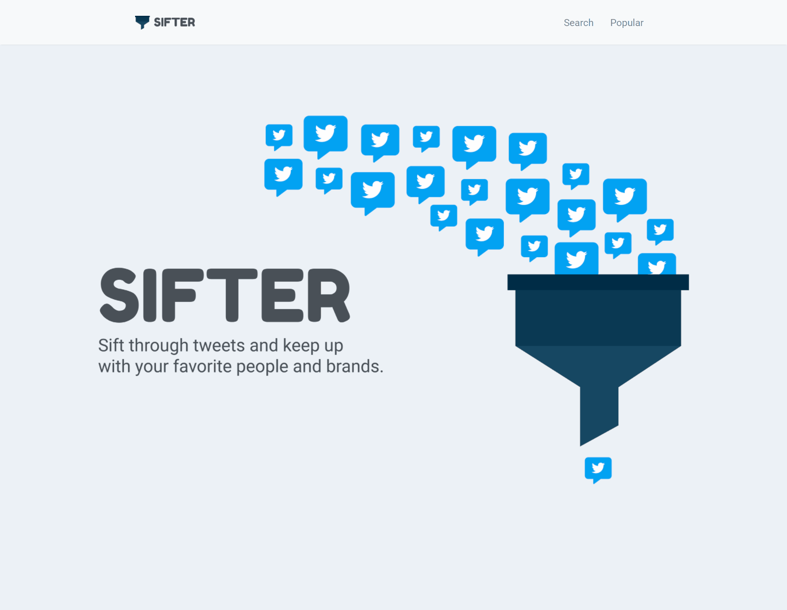

# Sifter App

*A full stack application that manipulates and displays curated tweets from twitter.*

Try it [here](https://sifterapp.azurewebsites.net/)

## Summary

This application uses, react, ASP.NET, twitter API, and authenthication to create a full-stack application that manipulates twitter data. The goal of this project is to create a user friendly application that allows the user to search for tweets by keyword or username. I learned how to create an API backend with custom endpoints to handle curated twitter data. This allowed me to fetch twitter tweet data as well as twitter user data. This application is deployed using microsoft azure.

## Author

* **Bryan Herrera** - *Full-Stack Developer* - [Website](http://bryan-herrera.com) | [LinkedIn](https://www.linkedin.com/in/bryan-chris-herrera/)  